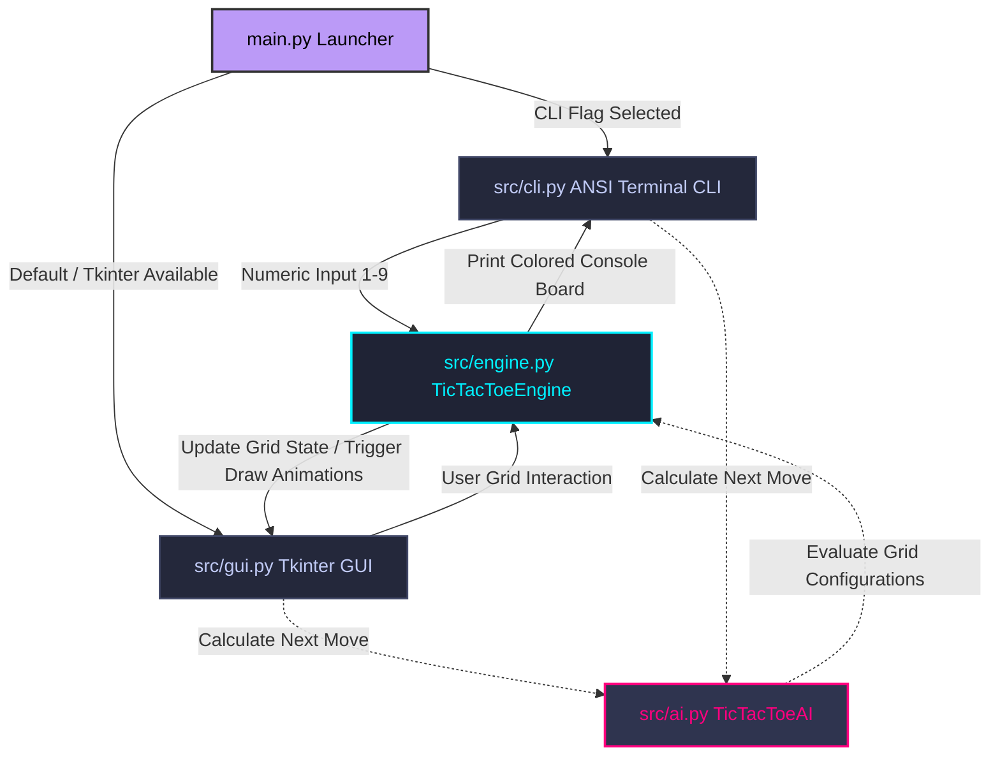

# 🎮 Unbeatable AI Tic-Tac-Toe Game

<div align="center">

[](https://www.python.org/)
[-00599C?style=for-the-badge&logo=python&logoColor=white)](https://docs.python.org/3/library/tkinter.html)
[](https://en.wikipedia.org/wiki/ANSI_escape_code)
[]()
[]()
[](LICENSE)

*A premium, object-oriented Python implementation of Tic-Tac-Toe featuring a sleek, dark-themed GUI with smooth Canvas vector animations, a colorized interactive CLI, and three AI levels including an unbeatable Minimax solver optimized with Alpha-Beta Pruning.*

[Explore Codebase](https://github.com/dhanish0711/ai-tic-tac-toe) • [Report Bug](https://github.com/dhanish0711/ai-tic-tac-toe/issues) • [Request Feature](https://github.com/dhanish0711/ai-tic-tac-toe/issues)

</div>

---

## 📌 Table of Contents
- [📖 Project Overview](#-project-overview)
- [🏛️ System Architecture](#️-system-architecture)
- [🚀 Key Features](#-key-features)
- [🧠 The AI Decision Engine](#-the-ai-decision-engine)
  - [Heuristics (Medium)](#heuristics-medium)
  - [Minimax & Alpha-Beta Pruning (Hard)](#minimax--alpha-beta-pruning-hard)
- [🖥️ User Interfaces](#️-user-interfaces)
  - [Modern Dark GUI](#modern-dark-gui)
  - [ANSI-Colored CLI](#ansi-colored-cli)
- [📦 Directory Structure](#-directory-structure)
- [⚙️ Installation & Run Guide](#️-installation--run-guide)
- [🧪 Automated Test Suite](#-automated-test-suite)
- [📄 License](#-license)
- [💖 Author](#-author)

---

## 📖 Project Overview
This project showcases decision-making algorithms applied to adversarial board games. It provides a robust, zero-dependency Python package implementing classical board game states alongside AI players:
1. **Easy (Randomized Choice)**: Introduces beginner-level entropy.
2. **Medium (Heuristics)**: Implements immediate-threat blocking and win-taking.
3. **Hard (Minimax with Alpha-Beta Pruning)**: Implements complete state space search, resolving optimal moves dynamically.

---

## 🏛️ System Architecture

The codebase separates the presentation layers (GUI & CLI), core game engine calculations, and game-tree search AI:



---

## 🚀 Key Features

- **Double-Interface Mode**: Play using a gorgeous desktop app window or directly in your system terminal.
- **Neon Vectors & Canvas Animations**: The GUI draws symbols and victory connection lines using incremental rendering frames, providing a highly responsive feel.
- **Scoreboard State Persistence**: Keeps track of match history (Player Wins, AI Wins, and Draws) during session play.
- **Unbeatable Opponent**: The Hard AI performs state-pruned backtracking, guaranteeing it never makes a mistake (you can only draw or lose).
- **Portable and Dependency-Free**: Entirely built on standard Python libraries. No `pip install` required to run or play.
- **Full Test Suite**: Contains 15 comprehensive assertions validating state machines, winning rows/diagonals, draws, and minimax perfect-play correctness.

---

## 🧠 The AI Decision Engine

### Heuristics (Medium)
The Medium difficulty uses a fast rule-based priority queue:
1. **Check for Win**: If the AI can complete a row/column/diagonal on this move, it immediately takes it.
2. **Check for Block**: If the human player can win on their next move, the AI places a token in that cell to block.
3. **Control Center**: Seizes the center square (index 4) if open.
4. **Acquire Corners**: Randomly selects among open corners (indices 0, 2, 6, 8).
5. **Acquire Edges**: Selects among open edges (indices 1, 3, 5, 7).

---

### Minimax & Alpha-Beta Pruning (Hard)
The Hard AI models Tic-Tac-Toe as a zero-sum game tree where players take turns choosing optimal cells:
- **Maximizer**: Wants to maximize the outcome score.
- **Minimizer**: Wants to minimize the outcome score.

#### Scoring Function
The engine recursively evaluates terminal board configurations and returns static scores:
$$\text{Score} = \begin{cases} +10 - \text{depth} & \text{AI Wins} \\ -10 + \text{depth} & \text{Human Wins} \\ 0 & \text{Draw} \end{cases}$$
*Note: Subtracting/adding depth prioritizes faster victories and delays unavoidable defeats.*

#### Alpha-Beta Optimization
Standard Minimax checks all $9! = 362,880$ game branches. Alpha-Beta pruning optimizes search times by discarding subtrees that won't affect the final decision:
- $\alpha$: Best score the maximizer is guaranteed so far.
- $\beta$: Best score the minimizer is guaranteed so far.

When evaluating a node, if $\beta \le \alpha$, it means the opponent can already force a worse position elsewhere, so the engine halts evaluation of that branch (pruning).

#### Efficiency Comparison
| Metric | Standard Minimax | Minimax with Alpha-Beta Pruning |
| :--- | :---: | :---: |
| **Max Tree States Explored** | ~362,880 | ~2,000 |
| **Average Move Compute Time** | ~150 ms | < 2 ms |
| **Decision Accuracy** | 100% | 100% |

---

## 🖥️ User Interfaces

### Modern Dark GUI
Built in Tkinter, styled to match premium IDE dark themes:
- Palette: Slate Dark (`#1a1b26`), Sidebar (`#24283b`), Grid lines (`#414868`).
- Neon tokens: Cyan (`#00f0ff`) for X, Hot Pink (`#ff007f`) for O.
- Controls: Toggle difficulty levels, change character tokens, or restart games on-the-fly.

### ANSI-Colored CLI
Designed for minimal CLI environments:
- Displays board indexes using soft gray numbers when empty, indicating inputs.
- Prints player symbols in bold neon colors with standard white dividers.

---

## 📦 Directory Structure

```
.
├── src/
│   ├── __init__.py
│   ├── engine.py       # Core Board Mechanics & Rules
│   ├── ai.py           # Easy, Medium, and Hard (Minimax) Algorithms
│   ├── gui.py          # Tkinter Graphical Layout & Animations
│   └── cli.py          # Terminal colored CLI Loop
├── tests/
│   ├── __init__.py
│   ├── test_engine.py  # Win/Draw validation tests
│   └── test_ai.py      # AI Decision-making tests
├── main.py             # Entry Point & CLI argument parser
├── LICENSE             # MIT License file
├── .gitignore          # Cache and environment file exclusions
└── README.md           # Documentation
```

---

## ⚙️ Installation & Run Guide

### Prerequisites
- **Python 3.10** or higher is required.
- Standard Tkinter package (included by default in Python installations on Windows and macOS).

### 1. Clone the repository
```bash
git clone https://github.com/dhanish0711/ai-tic-tac-toe.git
cd ai-tic-tac-toe
```

### 2. Launching the game

#### Run Desktop GUI (Default Mode):
```bash
python main.py
```

#### Run CLI Terminal Mode:
```bash
python main.py --mode cli
```

#### Command-Line Configurations
Customize launch parameters with flags:
```bash
python main.py --mode cli --difficulty hard --symbol O
```

| Argument | Option | Default | Description |
| :--- | :--- | :--- | :--- |
| `--mode` | `gui` \| `cli` | `gui` | Start graphical window or terminal interface. |
| `--difficulty` | `easy` \| `medium` \| `hard` | `hard` | Start game with chosen AI difficulty. |
| `--symbol` | `X` \| `O` | `X` | Start playing as X (goes first) or O (goes second). |

---

## 🧪 Automated Test Suite

We use Python's built-in `unittest` module to guarantee codebase stability.

To run all unit tests:
```bash
python -m unittest discover -s tests
```

### Coverage Assertions:
1. **State & Movement Integrity**: Validates empty initialization, turn alternation, occupied square rejection, and board resetting.
2. **Victory Configurations**: Asserts row wins, column wins, diagonal wins, and drawn matches.
3. **AI Pathfinding Validation**: Asserts that Medium and Hard AI secure winning moves and successfully block player winning paths.
4. **Self-Play Draw Proof**: Simulates 20 games of Hard AI (X) against Hard AI (O). The test verifies that **100% of these matches end in a Draw**, confirming the Minimax + Alpha-Beta algorithm behaves with mathematical optimality.

---

## 📄 License

Distributed under the MIT License. See [LICENSE](LICENSE) for details.

---

<div align="center">

Made with ❤️ by [Dhanish Ladwani](https://github.com/dhanish0711/)

</div>
